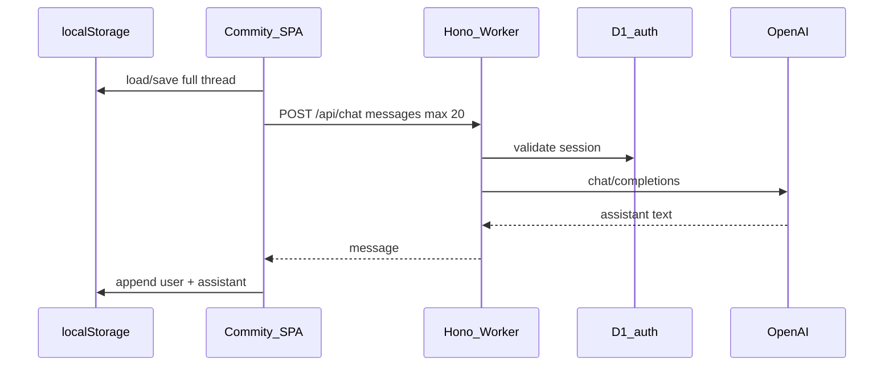

# Commity — implementation plan & status

Personal AI assistant at `commity.da-mr.com`: **one continuous chat** per account, history on the device, server sees **at most 20 messages** per request.

## Product decisions (locked)

| Topic | Choice |
| ----- | ------ |
| Message storage | **Browser `localStorage`** per user (`commity:thread:{userId}`). Not in D1. |
| Context window | Client sends **last 20 messages** on each `POST /api/chat`. Smart summarization later. |
| LLM | **OpenAI** (`chat/completions`) from the Worker via `OPENAI_API_KEY`. |
| Auth | **Same as compare** — cookie session, D1 `users` + `sessions` only. |
| Deploy | **Worker + SPA** (like compare): static `dist/` + Hono `/api/*` on one origin. |

---

## Done

### App scaffold (`apps/commity`)

- [x] React 19 + Vite 8 + Tailwind 4 package (`@playground/commity`)
- [x] UI primitives copied from compare (button, card, input, label, textarea, sonner)
- [x] Auth pages: login, register (English copy, no i18n)
- [x] `AuthContext` + `ProtectedRoute` + slim `AppLayout`
- [x] `ChatPage` — message list, composer, send, clear, export JSON backup
- [x] `ChatPageRoute` — remounts chat when `user.id` changes (loads correct local thread)
- [x] `src/lib/chatHistory.ts` — load/save/clear, `sliceForApi(max 20)`, memory fallback when `localStorage` is broken (Node 22 / vitest)
- [x] `src/lib/chatBackup.ts` — `exportThread`, `downloadThreadBackup`; `syncToCloud` stub (throws)
- [x] Unit tests for `chatHistory` (3 tests, vitest + happy-dom)
- [x] `README.md` — local dev steps
- [x] Vite dev on port **3003**, proxies `/api` → Worker **8788**

### Worker (`apps/commity/worker`, `@playground/commity-api`)

- [x] Hono app: `/api/health`, `/api/auth/*`, `POST /api/chat`
- [x] Auth: register, login, logout, me (no listing seed)
- [x] `POST /api/chat` — validates `messages` (1–20), calls OpenAI, returns assistant message (stateless)
- [x] `src/openai.ts` — non-streaming completions, default model `gpt-4o-mini`
- [x] **Gmail integration** — OAuth connect, `prepare_email` tool, review card, confirm send (`0002_gmail.sql`, `/api/gmail/*`)
- [x] **Gmail inbox via AI** — `gmail.modify` scope, inbox tools (search/star/trash), OpenAI tool loop, reconnect for legacy grants
- [x] D1 migration `0001_auth.sql` — `users`, `sessions` only
- [x] `wrangler.toml` — prod `commity.da-mr.com`, dev `dev-commity.da-mr.com`, assets binding
- [x] `.dev.vars.example` — `OPENAI_API_KEY`, `OPENAI_MODEL`

### Monorepo / deploy wiring

- [x] `pnpm-workspace.yaml` picks up `apps/commity` and `apps/commity/worker`
- [x] [`turbo.json`](../../turbo.json) — `VITE_COMMITY_ORIGIN` in build env
- [x] [`apps/main/index.html`](../main/index.html) — Commity project card + local port 3003
- [x] [`apps/main/vite.config.ts`](../main/vite.config.ts) — `COMMITY_ORIGIN` placeholder
- [x] [`.github/workflows/deploy.yml`](../../.github/workflows/deploy.yml) — `commity` path filter, `deploy-commity` + `deploy-commity-dev` jobs
- [x] [`AGENTS.md`](../../AGENTS.md) — Commity dev notes

---

## Left todo

### Must-do before first production deploy

- [x] **Fix build/lint** — `ChatPage` / `ChatPageRoute` / router wired; `type-check`, `build`, and `lint` pass (one react-refresh warning on `AuthContext`).
- [ ] **Create Cloudflare D1** databases `commity-db` / `commity-db-dev` and replace placeholder `database_id` in [`worker/wrangler.toml`](worker/wrangler.toml) (`00000000-…`).
- [ ] **Worker secrets**: `OPENAI_API_KEY`, `OPENAI_MODEL` (optional), `GOOGLE_CLIENT_ID`, `GOOGLE_CLIENT_SECRET`, `TOKEN_ENCRYPTION_KEY` on prod + dev workers.
- [ ] **Custom domains**: attach `commity.da-mr.com` and `dev-commity.da-mr.com` to `commity-api` / `commity-api-dev`.
- [ ] **Local smoke test**: copy `worker/.dev.vars.example` → `.dev.vars`, run migrations + both dev servers, register, send a message.

### Product / UX (v1 polish)

- [ ] **Import backup** — UI to restore thread from exported JSON (export exists; import does not).
- [ ] **Cloud backup** — implement `syncToCloud` / import (R2, D1 blob, or external provider — TBD).
- [ ] **Model selector** — optional UI; today Worker uses `OPENAI_MODEL` env only.
- [ ] **Streaming** — SSE/streaming assistant tokens to the UI.
- [ ] **Error UX** — rate limits, token limits, network retries.

### Out of scope (later)

- Smart context compression / summarization (reuse context IDs)
- Multiple chats / conversation folders
- Gmail reply threading (read inbox is done via chat tools)
- RAG and other tools beyond email draft
- Server-side message history

---

## Architecture (current)



## Key paths

| Path | Role |
| ---- | ---- |
| `src/pages/ChatPage.tsx` | Main chat UI |
| `src/lib/chatHistory.ts` | Local persistence + API slice |
| `worker/src/routes/chat.ts` | Chat API route |
| `worker/src/openai.ts` | OpenAI client |
| `worker/migrations/0001_auth.sql` | Auth schema |

## Local dev (quick)

```bash
# API
cp apps/commity/worker/.dev.vars.example apps/commity/worker/.dev.vars
pnpm --filter @playground/commity-api run db:migrate:local
pnpm --filter @playground/commity-api dev

# Client
pnpm --filter @playground/commity dev
```

Open http://localhost:3003
