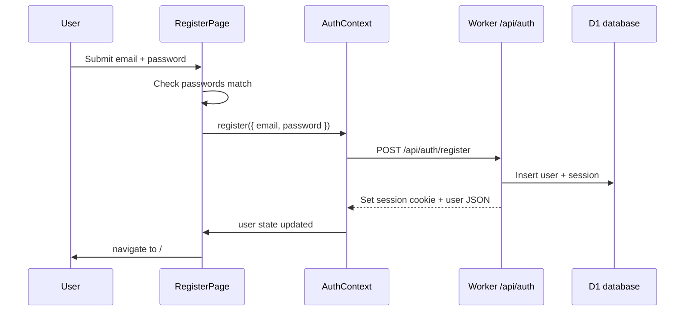

# 1. Create an account or sign in

This page explains how someone gets into Commity: registering, signing in, staying signed in, and signing out. It covers both what the user sees and what happens on the server.

**Related overview:** [SUMMARY.md](./SUMMARY.md)

---

## What the user experiences

- **New user:** opens `/register`, enters email + password (twice), clicks **Create account**, and lands on the chat at `/`.
- **Returning user:** opens `/login`, enters email + password, clicks **Sign in**, and lands on `/`.
- **Already signed in:** opening `/login` or `/register` still works, but after success they are sent to `/`. If they open `/` without a session, they are redirected to `/login`.
- **Sign out:** from the chat header, **Sign out** clears the session and sends them to `/login`.

The register screen reminds people: *“Chat history stays on your device”* — the account is for **identity and API access**, not for storing messages in the cloud.

---

## Where this lives in the app

| Piece | Role | File |
| ----- | ---- | ---- |
| Routes | `/login`, `/register`, protected `/` | `src/router.tsx` |
| Login UI | Form, errors, navigation | `src/pages/LoginPage.tsx` |
| Register UI | Form + confirm password | `src/pages/RegisterPage.tsx` |
| Auth state | Who is logged in, API calls | `src/contexts/AuthContext.tsx` |
| Gate for chat | Redirect if not logged in | `src/components/layout/ProtectedRoute.tsx` |
| HTTP helper | Calls `/api/auth/*` | `src/lib/api.ts` |
| API routes | Register, login, logout, me | `worker/src/auth.ts` |
| Session check | Read cookie, load user | `worker/src/middleware.ts` |
| Password hashing | Never store plain passwords | `worker/src/crypto.ts` |
| Database tables | `users`, `sessions` | `worker/migrations/0001_auth.sql` |

The app wraps everything in `AuthProvider` at startup (`src/main.tsx`), so any screen can call `useAuth()`.

---

## Flow: registration



### Client steps

1. **`RegisterPage`** validates that password and confirm match locally (no server round-trip for that).

```24:27:src/pages/RegisterPage.tsx
    if (password !== confirm) {
      setFormError('Passwords do not match')
      return
    }
```

2. It calls **`register`** from `AuthContext`, which POSTs to `/api/auth/register`.

```51:57:src/contexts/AuthContext.tsx
  const register = useCallback(async (input: RegisterInput) => {
    const u = await apiRequest<AuthUser>('/api/auth/register', {
      method: 'POST',
      body: input
    })
    setUser(u)
  }, [])
```

3. On success, the page navigates to `/` with `replace: true` so the user cannot “back” into the register form as if they were still logged out.

### Server steps (`worker/src/auth.ts`)

1. **Validate input** with Zod: email (normalized to lowercase), password length 8–128.

2. **Reject duplicate email** — generic message so attackers cannot easily enumerate accounts:

```39:41:worker/src/auth.ts
  if (existing) {
    return c.json({ error: 'Could not complete registration.' }, 400)
  }
```

3. **Create user** with a random `id`, **hashed password** (`hashPassword` in `crypto.ts`), and timestamp.

4. **Create session** row in `sessions` (random session id, `expires_at` ~30 days ahead).

5. **Set HTTP-only cookie** named `session` containing the session id (`setSessionCookie`).

6. **Return** `{ id, email, createdAt }` — no password fields.

---

## Flow: login

Same shape as register, but:

- Server looks up user by email.
- Returns **401** with `"Invalid email or password"` if user missing or password wrong (same message for both).
- On success: new session row + cookie + user JSON.

```65:97:worker/src/auth.ts
auth.post('/login', async (c) => {
  const payload = loginSchema.parse(await c.req.json())
  const email = payload.email.toLowerCase()
  // ... verify password_hash ...
  setSessionCookie(c, sessionId)
  return c.json({
    id: user.id,
    email: user.email,
    createdAt: user.created_at
  })
})
```

**Login page** mirrors register: form state, `ApiError` for server messages, navigate to `/` on success (`LoginPage.tsx`).

---

## How “am I still logged in?” works

On every full page load, **`AuthProvider`** calls `GET /api/auth/me` before showing protected content:

```26:41:src/contexts/AuthContext.tsx
  useEffect(() => {
    let cancelled = false
    apiRequest<AuthUser>('/api/auth/me')
      .then((u) => {
        if (!cancelled) setUser(u)
      })
      .catch(() => {
        if (!cancelled) setUser(null)
      })
      .finally(() => {
        if (!cancelled) setIsLoading(false)
      })
```

- **`ProtectedRoute`** shows a spinner while `isLoading` is true, then either the child layout or a redirect to `/login`.

```6:21:src/components/layout/ProtectedRoute.tsx
export function ProtectedRoute({ children }: { children: React.ReactNode }) {
  const { user, isLoading } = useAuth()
  // ... loading spinner ...
  if (!user) {
    return <Navigate to="/login" replace />
  }
  return children
}
```

### Server: `requireAuth` middleware

For `/api/auth/me`, `/api/chat`, Gmail routes, etc., the worker:

1. Reads the `session` cookie.
2. Loads `sessions` row from D1; checks `expires_at`.
3. Deletes expired sessions and returns 401.
4. Sets `userId` on the request context for handlers.

```7:27:worker/src/middleware.ts
export async function requireAuth(c: Context<AppEnv>, next: Next) {
  const token = getCookie(c, SESSION_COOKIE)
  if (!token) return c.json({ error: 'Unauthorized' }, 401)
  // ... lookup session, check expiry ...
  c.set('userId', row.user_id)
  await next()
}
```

**Cookie flags** (production): `httpOnly`, `secure`, `sameSite: 'Lax'`, 30-day `maxAge` — see `setSessionCookie` in `auth.ts`. The browser sends this cookie on same-origin `/api` requests automatically.

---

## Flow: logout

1. Chat header calls `logout()` from `AuthContext`.
2. `POST /api/auth/logout` (requires auth) deletes **all** sessions for that user in D1 and clears the cookie.
3. Client sets `user` to `null` even if the network call fails.
4. Chat page sets `window.location.href = '/login'` for a clean reset.

---

## Security notes (plain language)

| Topic | Behavior |
| ----- | -------- |
| Passwords | Stored as salted PBKDF2 hashes, never plain text (`worker/src/crypto.ts`). |
| Session | Opaque random id in cookie; server looks up user id in D1. |
| API without login | `api.ts` redirects to `/login` on 401 for non-auth paths. |
| Chat/Gmail | Global middleware in `worker/src/index.ts` applies `requireAuth` except health, auth routes, and Gmail OAuth callback. |

---

## Common errors users may see

| Message | Typical cause |
| ------- | ------------- |
| Passwords do not match | Client-only check on register |
| Could not complete registration | Email already registered |
| Invalid email or password | Wrong credentials on login |
| (Redirect to login) | Session expired or cookie missing |

---

## What to try locally

1. Start API + UI (see `README.md`).
2. Register a test account → should land on empty chat.
3. Sign out → should return to login.
4. Sign in again → same account; chat history depends on **same browser** (local storage keyed by `user.id`).

**Next:** [02-chat-screen.md](./02-chat-screen.md) — sending messages after you are logged in.
