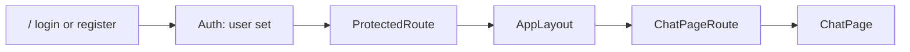
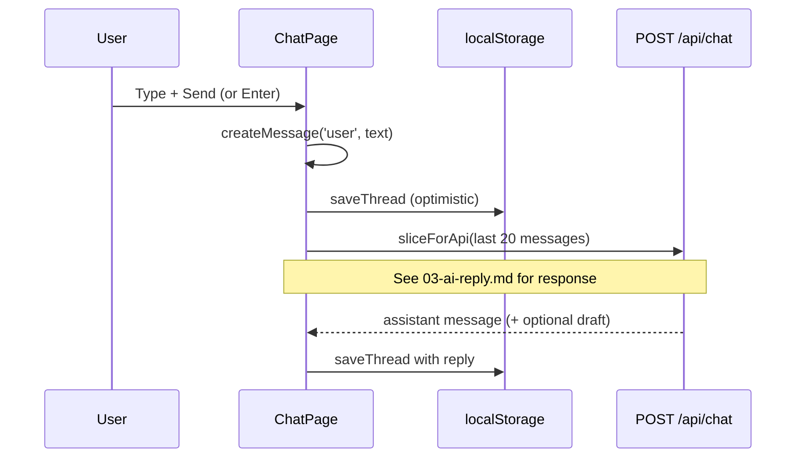

# 2. The chat screen — typing and sending a message

After sign-in, the main experience is a single chat page: message list, text box, and actions in the header. This doc walks through that UI and what happens when you press **Send** (before the AI reply is covered in depth in [03-ai-reply.md](./03-ai-reply.md)).

**Related overview:** [SUMMARY.md](./SUMMARY.md)

---

## What the user sees

- **Header:** app name, your account email, Gmail connect/disconnect, **Sign out**.
- **Toolbar:** **Export backup**, **Clear** (disabled when there are no messages).
- **Middle:** scrollable list of bubbles (your messages on the right, assistant on the left).
- **Bottom:** multiline **Message…** field, **Send** button, hint that only the last 20 messages are sent to the server.

Empty state copy nudges people toward email drafts: *“Ask me to draft an email…”*

---

## How you get to this screen



| Step | File | What happens |
| ---- | ---- | ------------ |
| Route `/` | `src/router.tsx` | Wrapped in `ProtectedRoute` + `AppLayout` |
| User required | `ProtectedRoute.tsx` | Redirect to `/login` if no user |
| Per-user chat | `ChatPageRoute.tsx` | Passes `user.id` and `user.email` into `ChatPage` |

**Important:** `ChatPage` is rendered with `key={user.id}` so React **remounts** the chat when a different account logs in on the same browser. That loads the correct `localStorage` thread for that user.

```4:8:src/pages/ChatPageRoute.tsx
export function ChatPageRoute() {
  const { user } = useAuth()
  if (!user) return null
  return <ChatPage key={user.id} userId={user.id} userEmail={user.email} />
}
```

---

## State inside `ChatPage`

Main file: `src/pages/ChatPage.tsx`.

| State | Purpose |
| ----- | ------- |
| `messages` | Full thread (loaded from local storage on mount) |
| `draft` | Text currently in the composer |
| `isSending` | Blocks double-send, shows “Thinking…” |
| Gmail query | `useQuery` → `fetchGmailStatus()` for connect badge |

**Load on mount:**

```36:38:src/pages/ChatPage.tsx
  const [messages, setMessages] = useState<ChatMessage[]>(() =>
    loadThread(userId)
  )
```

**Persist after every change:**

```77:82:src/pages/ChatPage.tsx
  const persistMessages = useCallback(
    (next: ChatMessage[]) => {
      setMessages(next)
      saveThread(userId, next)
    },
    [userId]
  )
```

Storage format and keys are documented in [06-chat-history-backup.md](./06-chat-history-backup.md) (`src/lib/chatHistory.ts`).

---

## Sending a message (step by step)



### 1. User triggers send

- **Send** button → `handleSend`
- **Enter** without Shift → same (`handleKeyDown`)
- Shift+Enter → new line in textarea

Guards: empty draft, or already `isSending`.

### 2. Optimistic UI update

The user message is appended **immediately** so the UI feels responsive:

```98:102:src/pages/ChatPage.tsx
    const prevMessages = messages
    const userMessage = createMessage('user', text)
    const nextMessages = [...prevMessages, userMessage]
    persistMessages(nextMessages)
    setDraft('')
```

`createMessage` adds `id` (UUID), `role`, `content`, `createdAt` (`chatHistory.ts`).

### 3. API request

Only **role + content** for the last 20 messages go to the server — not ids, not email draft metadata:

```106:108:src/pages/ChatPage.tsx
      const data = await apiRequest<ChatResponse>('/api/chat', {
        method: 'POST',
        body: { messages: sliceForApi(nextMessages) }
      })
```

```136:141:src/lib/chatHistory.ts
export function sliceForApi(
  messages: ChatMessage[],
  max = MAX_API_MESSAGES
): ApiChatMessage[] {
  return messages.slice(-max).map(({ role, content }) => ({ role, content }))
}
```

The route validates 1–20 messages (`worker/src/routes/chat.ts`).

### 4. Success: append assistant message

```110:118:src/pages/ChatPage.tsx
      const assistantMessage = createMessage(
        'assistant',
        data.message.content,
        {
          emailDraft: data.emailDraft
        }
      )
      const withReply = [...nextMessages, assistantMessage]
      persistMessages(withReply)
```

If the server returned an email draft but Gmail is not connected, a toast offers **Connect** ([04-connect-gmail.md](./04-connect-gmail.md)).

### 5. Failure: roll back

On error, the UI **restores** the previous message list and puts the typed text back in the composer:

```130:135:src/pages/ChatPage.tsx
    } catch (err) {
      const msg =
        err instanceof ApiError ? err.message : 'Failed to get a response'
      toast.error(msg)
      persistMessages(prevMessages)
      setDraft(text)
```

So a failed API call does not leave a “orphan” user message in history (unless you change this behavior later).

### 6. Loading indicator

While waiting, `isSending` is true and the list shows a **Thinking…** row with a spinner.

---

## Rendering messages

Each `ChatMessage` becomes a list item:

- **Bubble** — styling by `role` (`user` vs `assistant`).
- **Optional `EmailDraftCard`** — if `msg.emailDraft` is set ([05-email-draft-review.md](./05-email-draft-review.md)).

```243:271:src/pages/ChatPage.tsx
            {messages.map((msg) => (
              <li key={msg.id} className="flex flex-col">
                <div className={cn(/* user vs assistant styles */)}>
                  {msg.content}
                </div>
                {msg.emailDraft ? (
                  <EmailDraftCard
                    draft={msg.emailDraft}
                    gmailConnected={gmailConnected}
                    sent={msg.emailSent === true}
                    onDraftChange={...}
                    onDiscard={...}
                    onSent={() => updateMessage(msg.id, { emailSent: true })}
                  />
                ) : null}
              </li>
            ))}
```

`updateMessage` patches one message in the array and re-saves to local storage (used when editing a draft or marking sent).

---

## Other header actions (brief)

| Action | Handler | See also |
| ------ | ------- | -------- |
| Connect Gmail | Link to `/api/gmail/connect` | [04-connect-gmail.md](./04-connect-gmail.md) |
| Disconnect Gmail | `disconnectGmail()` | [04-connect-gmail.md](./04-connect-gmail.md) |
| Export backup | `downloadThreadBackup(messages)` | [06-chat-history-backup.md](./06-chat-history-backup.md) |
| Clear | `clearThread(userId)` + empty state | [06-chat-history-backup.md](./06-chat-history-backup.md) |
| Sign out | `logout()` + redirect | [01-account-login.md](./01-account-login.md) |

---

## Gmail callback toast

If the user returns from Google OAuth, the URL may contain `?gmail=connected` or `?gmail=error`. An effect strips the query param and shows a toast (`ChatPage.tsx` lines 51–68).

---

## Types reference

`ChatMessage` (client) includes optional `emailDraft` and `emailSent` — see `src/types` / usage in `chatHistory.ts` parser.

`ChatResponse` from the API (`src/lib/gmail.ts`):

```9:13:src/lib/gmail.ts
export type ChatResponse = {
  message: { role: 'assistant'; content: string }
  emailDraft?: EmailDraft
  gmailRequired?: boolean
}
```

---

## Design choices worth knowing

1. **One thread per user id** — no chat picker UI; switching accounts switches storage key.
2. **Client-owned history** — server is stateless for messages; see [06-chat-history-backup.md](./06-chat-history-backup.md).
3. **20-message window** — older lines stay on device but are not sent to OpenAI on that turn.
4. **No streaming** — full assistant text arrives in one response ([03-ai-reply.md](./03-ai-reply.md)).

**Next:** [03-ai-reply.md](./03-ai-reply.md) — what the server does with those messages and OpenAI.
