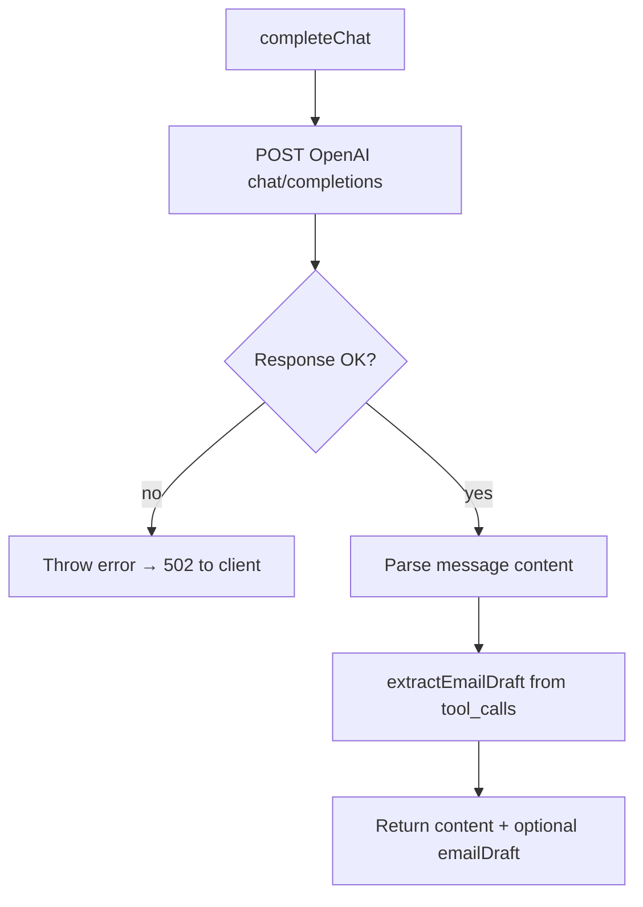

# 3. Reading the assistant’s reply (OpenAI on the server)

When you press **Send**, the browser calls the worker; the worker calls **OpenAI** and returns one assistant message (and sometimes structured email fields). This page explains that server-side “brain” — not the chat bubbles UI ([02-chat-screen.md](./02-chat-screen.md)).

**Related overview:** [SUMMARY.md](./SUMMARY.md)

---

## Plain-language summary

1. Your last messages (up to 20) arrive at `POST /api/chat`.
2. The server checks you are logged in.
3. It sends those messages plus a fixed **system instruction** to OpenAI.
4. OpenAI returns text; it may also “call a tool” to fill in email fields (`to`, `subject`, `body`).
5. The server packages text + optional draft into JSON; the browser saves it in local chat history.

The OpenAI API key **never** reaches the browser — it lives only in Worker secrets (`OPENAI_API_KEY`).

---

## Entry point: chat route

File: `worker/src/routes/chat.ts`

```19:36:worker/src/routes/chat.ts
chat.post('/', requireAuth, async (c) => {
  const userId = c.get('userId')
  const { messages } = chatSchema.parse(await c.req.json())

  const result = await completeChat(
    c.env.OPENAI_API_KEY,
    c.env.OPENAI_MODEL,
    messages
  )

  const gmailAccount = await getGmailAccount(c.env.DB, userId)
  const gmailConnected = Boolean(gmailAccount)

  return c.json({
    message: { role: 'assistant' as const, content: result.content },
    ...(result.emailDraft ? { emailDraft: result.emailDraft } : {}),
    ...(result.emailDraft && !gmailConnected ? { gmailRequired: true } : {})
  })
})
```

| Field in response | Meaning |
| ----------------- | ------- |
| `message.content` | What the assistant “said” in the bubble |
| `emailDraft` | Optional structured email (from tool call) |
| `gmailRequired` | `true` if there is a draft but Gmail not linked — UI prompts connect |

Validation (`chatSchema`):

- Each message: `role` ∈ `user` | `assistant` | `system`, `content` 1–32 000 chars.
- Array length: **1–20** messages.

---

## Core logic: `completeChat`

File: `worker/src/openai.ts`



### System prompt

The model is told it is **Commity**, should use the email tool when appropriate, and must **not** claim an email was sent:

```24:27:worker/src/openai.ts
const SYSTEM_PROMPT = `You are Commity, a helpful personal assistant.
When the user wants to write or send an email, call the prepare_email tool with a complete draft.
Never claim an email was sent — the user must review and confirm sending separately.
If the request is not about email, respond normally without using tools.`
```

### Model and request shape

```122:138:worker/src/openai.ts
export async function completeChat(
  apiKey: string,
  model: string | undefined,
  messages: ChatMessageInput[]
): Promise<ChatCompletionResult> {
  const response = await fetch(`${OPENAI_BASE}/chat/completions`, {
    method: 'POST',
    headers: {
      Authorization: `Bearer ${apiKey}`,
      'Content-Type': 'application/json'
    },
    body: JSON.stringify({
      model: model?.trim() || DEFAULT_MODEL,
      messages: [{ role: 'system', content: SYSTEM_PROMPT }, ...messages],
      tools: [PREPARE_EMAIL_TOOL],
      tool_choice: 'auto'
    })
  })
```

- **Default model:** `gpt-4o-mini` (`DEFAULT_MODEL`).
- **Override:** `OPENAI_MODEL` env var on the worker.
- **Not streaming:** entire completion in one HTTP response (product limitation).

### The `prepare_email` tool

Defined as an OpenAI “function” tool with JSON schema for `to`, `subject`, `body`, optional `cc` / `bcc` (`PREPARE_EMAIL_TOOL` in `openai.ts`). The model decides when to call it (`tool_choice: 'auto'`).

---

## Parsing the OpenAI response

### Email draft from tool calls

```108:119:worker/src/openai.ts
function extractEmailDraft(
  toolCalls: OpenAIToolCall[] | undefined
): EmailDraft | undefined {
  if (!toolCalls?.length) return undefined
  for (const call of toolCalls) {
    if (call.function?.name !== 'prepare_email') continue
    const args = call.function.arguments
    if (typeof args !== 'string') continue
    const draft = parsePrepareEmailArgs(args)
    if (draft) return draft
  }
  return undefined
}
```

`parsePrepareEmailArgs` JSON-parses arguments and requires non-empty `to`, `subject`, `body`. Invalid tool JSON is ignored (no draft).

### Assistant text content

```152:166:worker/src/openai.ts
  const content =
    typeof message?.content === 'string' && message.content.trim()
      ? message.content.trim()
      : emailDraft
        ? "I've prepared an email draft for you to review below."
        : ''

  if (!content && !emailDraft) {
    throw new Error('OpenAI returned an empty response')
  }

  return {
    content: content || "I've prepared an email draft for you to review below.",
    emailDraft
  }
```

So if the model only returns a tool call with no user-visible text, the user still sees a friendly default line above the draft card.

---

## Errors reaching the user

| Layer | Behavior |
| ----- | -------- |
| OpenAI HTTP error | `completeChat` throws with OpenAI’s message |
| Worker `app.onError` | Often **502** with `{ error: "..." }` (`worker/src/index.ts`) |
| Client `ChatPage` | `toast.error`, rolls back optimistic user message |

Zod validation failures on bad body → **400** with validation details.

---

## What is *not* sent to OpenAI

- Message ids, timestamps, `emailSent` flags.
- Older than the last 20 turns (client slices before POST).
- Gmail tokens (Gmail is only used on separate `/api/gmail/send` after user confirms — [05-email-draft-review.md](./05-email-draft-review.md)).

---

## Configuration checklist

| Variable | Where | Purpose |
| -------- | ----- | ------- |
| `OPENAI_API_KEY` | `worker/.dev.vars` / Wrangler secret | Authenticate to OpenAI |
| `OPENAI_MODEL` | Optional | e.g. `gpt-4o-mini` |

---

## Files to read when debugging “bad replies”

| File | Look for |
| ---- | -------- |
| `worker/src/openai.ts` | Prompt, tool definition, parsing |
| `worker/src/routes/chat.ts` | Request validation, `gmailRequired` |
| `src/pages/ChatPage.tsx` | How response is stored |
| `src/lib/chatHistory.ts` | `sliceForApi` — what model actually sees |

**Next:** [04-connect-gmail.md](./04-connect-gmail.md) if the user needs to send mail, or [05-email-draft-review.md](./05-email-draft-review.md) for the review card.
