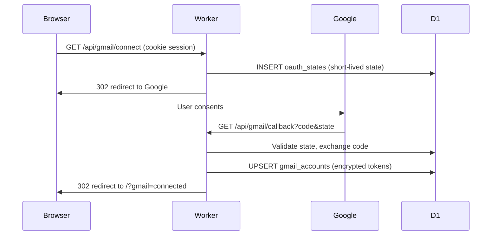

# 4. Connecting Gmail (optional)

Gmail is **optional**. You can chat without it. Connection enables the assistant to **search and manage** your inbox in chat, and to **send** mail after you review a draft.

Nothing is sent during the Google permission screen — only after you click **Send email** on a draft card ([05-email-draft-review.md](./05-email-draft-review.md)).

**Related overview:** [SUMMARY.md](./SUMMARY.md)

---

## What the user does

1. On the chat page header, click **Connect Gmail** (or **Connect Gmail** on a draft card when not connected).
2. Browser goes to Google’s consent screen.
3. User approves access for the Commity OAuth app.
4. Browser returns to the chat with `?gmail=connected` (or `?gmail=error`).
5. Header shows the connected Gmail address; disconnect via the unplug icon.

**Scopes requested** (server constants in `worker/src/gmail/oauth.ts`):

| Scope | Why |
| ----- | --- |
| `gmail.modify` | Read/search inbox, star, trash, and send messages you confirm |
| `userinfo.email` | Show which Google account is linked |

**Re-consent:** If you connected before inbox tools shipped, `GET /api/gmail/status` returns `needsReconnect: true` until you click **Reconnect Gmail** (same OAuth flow; `prompt=consent` requests the broader scope).

---

## Code map

| Layer | File | Responsibility |
| ----- | ---- | ---------------- |
| UI link | `src/pages/ChatPage.tsx` | `<a href={connectGmailUrl()}>` |
| URL helper | `src/lib/gmail.ts` | `connectGmailUrl()` → `/api/gmail/connect` |
| Status polling | `ChatPage.tsx` + `fetchGmailStatus` | `GET /api/gmail/status` |
| Routes | `worker/src/gmail/routes.ts` | connect, callback, status, disconnect, send |
| OAuth helpers | `worker/src/gmail/oauth.ts` | URLs, state, token exchange, refresh |
| Token encryption | `worker/src/gmail/tokenCrypto.ts` | Encrypt refresh/access tokens at rest |
| Send MIME | `worker/src/gmail/gmailApi.ts` | Build message, call Gmail API |
| DB schema | `worker/migrations/0002_gmail.sql` | `gmail_accounts`, `oauth_states` |

---

## Connect flow (sequence)



### Step 1: Start connect (`GET /api/gmail/connect`)

Requires login (`requireAuth`).

```49:55:worker/src/gmail/routes.ts
gmail.get('/connect', requireAuth, async (c) => {
  const userId = c.get('userId')
  const state = await createOAuthState(c.env.DB, userId)
  const redirectUri = redirectUriFromRequest(c.req.url, originOptions(c))
  const url = buildGoogleAuthUrl(c.env.GOOGLE_CLIENT_ID, redirectUri, state)
  return c.redirect(url)
})
```

- **`state`:** random UUID stored in D1 for ~10 minutes (`createOAuthState` in `oauth.ts`) — prevents CSRF-style confusion between users.
- **`redirect_uri`:** must match exactly what is registered in Google Cloud Console, e.g. `http://localhost:3003/api/gmail/callback` when using Vite proxy.

### Step 2: Public callback (`GET /api/gmail/callback`)

**Does not** use `requireAuth` — user identity comes from the **state** row, not the session cookie alone.

```57:74:worker/src/gmail/routes.ts
gmail.get('/callback', async (c) => {
  const code = c.req.query('code')
  const state = c.req.query('state')
  // ...
  const userId = await consumeOAuthState(c.env.DB, state)
  if (!userId) {
    return c.redirect(errorRedirect)
  }
```

On success:

1. Exchange `code` for access + refresh tokens (`exchangeCodeForTokens`).
2. Fetch Google account email (`fetchGoogleAccountEmail`).
3. Encrypt tokens with `TOKEN_ENCRYPTION_KEY`.
4. Upsert `gmail_accounts` for `user_id`.
5. Redirect to `/?gmail=connected`.

On failure → `/?gmail=error`.

`consumeOAuthState` **deletes** the state row when used (one-time).

### Step 3: UI feedback

`ChatPage` reads query params and shows toast, then cleans the URL (see [02-chat-screen.md](./02-chat-screen.md)).

---

## How redirect URI is chosen

Local dev often runs UI on **3003** and API on **8788**, but the browser only talks to **3003** (Vite proxies `/api`).

`resolvePublicOrigin` in `oauth.ts`:

1. Use `APP_PUBLIC_ORIGIN` from env if set (recommended in `.dev.vars`: `http://localhost:3003`).
2. Else use `X-Forwarded-Host` / `X-Forwarded-Proto` from Vite proxy.
3. Else use the request URL’s origin.

```40:56:worker/src/gmail/oauth.ts
export function resolvePublicOrigin(
  requestUrl: string,
  options?: OriginResolveOptions
): string {
  const configured = options?.publicOrigin?.trim().replace(/\/$/, '')
  if (configured) return configured
  // ... forwarded headers ...
  return new URL(requestUrl).origin
}
```

Mismatch between this origin and Google Console redirect URIs is the **most common** local OAuth failure.

---

## Status and disconnect

### Status — `GET /api/gmail/status`

```40:47:worker/src/gmail/routes.ts
gmail.get('/status', requireAuth, async (c) => {
  const userId = c.get('userId')
  const account = await getGmailAccount(c.env.DB, userId)
  if (!account) {
    return c.json({ connected: false })
  }
  return c.json({ connected: true, email: account.google_email })
})
```

Client: React Query in `ChatPage` (`queryKey: ['gmail', 'status']`).

### Disconnect — `POST /api/gmail/disconnect`

Deletes the `gmail_accounts` row for the user. Does not revoke the app in Google account settings (user can still do that manually in Google).

---

## What is stored in D1

From `0002_gmail.sql`:

- `google_email` — display in header.
- `refresh_token_enc`, `access_token_enc` — encrypted; used to obtain valid access tokens when sending.
- `access_expires_at` — refreshed as needed (`getValidAccessToken` in `oauth.ts`).

**Not stored:** email body text from chat (stays in browser).

---

## Link to chat / AI

When OpenAI returns an `emailDraft` but Gmail is not connected, `POST /api/chat` adds `gmailRequired: true` ([03-ai-reply.md](./03-ai-reply.md)). The chat UI shows a toast with a **Connect** action.

Sending the mail is a **separate** step: `POST /api/gmail/send` after user edits the draft ([05-email-draft-review.md](./05-email-draft-review.md)).

---

## Environment variables

| Variable | Purpose |
| -------- | ------- |
| `GOOGLE_CLIENT_ID` | OAuth client |
| `GOOGLE_CLIENT_SECRET` | OAuth client secret |
| `TOKEN_ENCRYPTION_KEY` | 32-byte key (base64) for token encryption |
| `APP_PUBLIC_ORIGIN` | Local: align redirect with Vite (e.g. `http://localhost:3003`) |

See `worker/.dev.vars.example` and root `README.md` for Google Cloud setup steps.

---

## Security middleware note

`worker/src/index.ts` exempts only `/api/gmail/callback` from the global auth middleware (callback uses `state` instead). Connect, status, disconnect, and send all require a session.

**Next:** [05-email-draft-review.md](./05-email-draft-review.md) — review card and actually sending.
