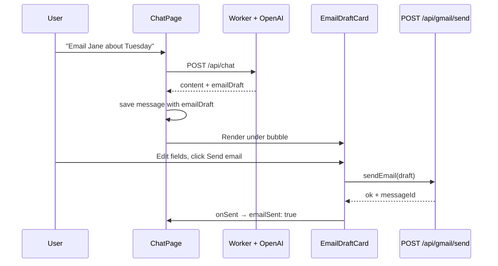

# 5. Email draft review and send

When you ask the assistant to write email, the AI may return structured fields (`to`, `subject`, `body`, …). The app shows a **review card** under the assistant message. You edit, then explicitly **Send** or **Discard**. The AI never sends mail by itself.

**Related:** [03-ai-reply.md](./03-ai-reply.md) (how drafts are created), [04-connect-gmail.md](./04-connect-gmail.md) (Gmail connection).

---

## End-to-end flow



---

## Where the draft comes from

1. OpenAI calls tool `prepare_email` on the server (`worker/src/openai.ts`).
2. `POST /api/chat` includes `emailDraft` in JSON when present.
3. `ChatPage` stores it on the assistant `ChatMessage`:

```110:116:src/pages/ChatPage.tsx
      const assistantMessage = createMessage(
        'assistant',
        data.message.content,
        {
          emailDraft: data.emailDraft
        }
      )
```

4. If `gmailRequired` is true, a toast nudges the user to connect Gmail ([04-connect-gmail.md](./04-connect-gmail.md)).

---

## The review card UI

File: `src/components/EmailDraftCard.tsx`

### Props

| Prop | Meaning |
| ---- | ------- |
| `draft` | Current `EmailDraft` (`to`, `subject`, `body`, optional `cc`) |
| `gmailConnected` | Whether send button can call API |
| `sent` | After successful send, show green “Email sent” summary |
| `onDraftChange` | Persist edits back into chat history |
| `onDiscard` | Remove draft from message |
| `onSent` | Mark `emailSent: true` on the message |

### Local editing state

The card keeps `local` state copy of `draft` so typing is smooth; each change calls `onDraftChange` so **`ChatPage`** updates `localStorage` via `updateMessage`.

Fields shown:

- **To** (required for send)
- **Cc** (optional)
- **Subject**
- **Body** (textarea)

If Gmail is not connected, an amber banner explains you can still edit but must connect to send.

### Send button

```38:51:src/components/EmailDraftCard.tsx
  const handleSend = async () => {
    if (!gmailConnected || sent || isSending) return
    setIsSending(true)
    try {
      await sendEmail(local)
      toast.success('Email sent')
      onSent()
    } catch (err) {
      const message =
        err instanceof Error ? err.message : 'Failed to send email'
      toast.error(message)
    } finally {
      setIsSending(false)
    }
  }
```

`sendEmail` → `POST /api/gmail/send` (`src/lib/gmail.ts`).

### Discard

**Discard** calls `onDiscard` from `ChatPage`, which clears `emailDraft` and `emailSent` on that message — the bubble text remains, only the card goes away.

### After send

UI switches to a compact green confirmation with recipient and subject (no editable fields).

---

## Wiring in `ChatPage`

```255:270:src/pages/ChatPage.tsx
                {msg.emailDraft ? (
                  <EmailDraftCard
                    draft={msg.emailDraft}
                    gmailConnected={gmailConnected}
                    sent={msg.emailSent === true}
                    onDraftChange={(next: EmailDraft) =>
                      updateMessage(msg.id, { emailDraft: next })
                    }
                    onDiscard={() =>
                      updateMessage(msg.id, {
                        emailDraft: undefined,
                        emailSent: undefined
                      })
                    }
                    onSent={() => updateMessage(msg.id, { emailSent: true })}
                  />
                ) : null}
```

`gmailConnected` comes from React Query (`fetchGmailStatus`) — same source as the header badge.

---

## Server: sending mail

File: `worker/src/gmail/routes.ts` — `POST /api/gmail/send`

1. **Auth** required.
2. **Validate** body with Zod (`to`, `subject`, `body`, optional `cc`/`bcc`, length limits).
3. Load `gmail_accounts` for user; 400 if missing.
4. **`getValidAccessToken`** — decrypt refresh token, refresh access token if expired (`oauth.ts`).
5. **`sendGmailMessage`** — build RFC-style MIME, base64url encode, POST to Gmail API (`gmailApi.ts`).

```139:157:worker/src/gmail/routes.ts
gmail.post('/send', requireAuth, async (c) => {
  const userId = c.get('userId')
  const payload = sendSchema.parse(await c.req.json())
  const account = await getGmailAccount(c.env.DB, userId)
  if (!account) {
    return c.json({ error: 'Gmail is not connected' }, 400)
  }
  const accessToken = await getValidAccessToken(/* ... */)
  const result = await sendGmailMessage(accessToken, payload)
  return c.json({ ok: true, messageId: result.id })
})
```

Plain-text body only in v1 (`Content-Type: text/plain` in MIME builder).

---

## Persistence of draft state

`chatHistory.ts` serializes `emailDraft` and `emailSent` inside the JSON array in `localStorage`. Reloading the page keeps an unsent draft visible until you send or discard.

Parser guards invalid draft shapes on load (`parseEmailDraft`).

---

## Trust model (for product / support)

| Action | Who initiates |
| ------ | ------------- |
| Draft text | AI suggests; user can edit all fields |
| Send | User clicks **Send email** only |
| Connect Gmail | User clicks connect link |
| Model claims “I sent it” | System prompt forbids; sending is not a chat tool |

---

## Troubleshooting

| Symptom | Likely cause |
| ------- | ------------- |
| Card shows, Send disabled / Connect shown | Gmail not connected — [04-connect-gmail.md](./04-connect-gmail.md) |
| Toast “Gmail is not connected” on send | Account row deleted or token invalid |
| Draft missing after refresh | `localStorage` cleared or different browser |
| No card, only text reply | Model did not call `prepare_email`; rephrase request |

**Next:** [06-chat-history-backup.md](./06-chat-history-backup.md) — clear, export, future import.
