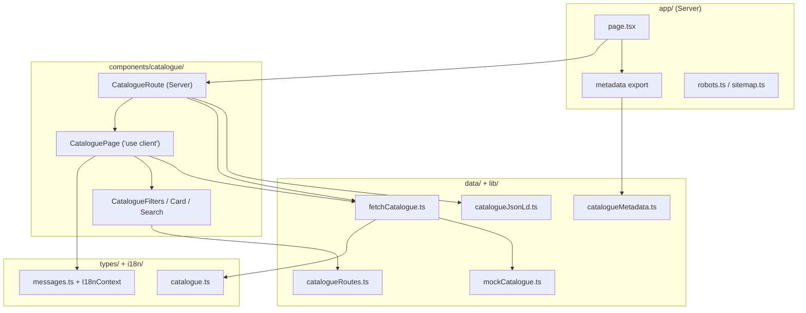

# compare-next — Architecture

Next.js 16 app for **compare.da-mr.com**: a product-comparison catalogue with
SEO-first routing, infinite scroll, and Cloudflare deployment via OpenNext.

Repo-wide coding rules live in [`AGENTS.md`](../../AGENTS.md). This document
covers **where code goes** and **how layers interact** inside this app.

---

## Stack

| Layer | Choice |
| ----- | ------ |
| Framework | Next.js 16 (App Router) |
| UI | React 19 |
| Data fetching (client) | TanStack React Query (`useInfiniteQuery`) |
| Styling | SCSS modules via `src/styles/` (BEM-style class names) |
| i18n | Custom context + typed message IDs (`src/i18n/`) |
| Deploy | `@opennextjs/cloudflare` → Cloudflare Workers |
| Package | `@playground/compare-next` |

---

## Folder structure

```
apps/compare-next/
├── src/
│   ├── app/                    # Next.js routes (thin — no business logic)
│   │   ├── layout.tsx          # Root layout, global metadata, Providers
│   │   ├── page.tsx            # Home → new sort, isHome
│   │   ├── new/page.tsx        # /new catalogue
│   │   ├── hot/page.tsx        # /hot catalogue
│   │   ├── popular/page.tsx    # /popular catalogue
│   │   ├── robots.ts           # robots.txt
│   │   └── sitemap.ts          # sitemap.xml
│   ├── components/
│   │   ├── catalogue/          # Catalogue feature UI
│   │   ├── layout/               # App shell (header, footer, nav)
│   │   └── providers/            # Client providers (React Query, i18n)
│   ├── contexts/                 # React context definitions + hooks
│   ├── data/                     # Data access: fetch, filter, paginate
│   ├── i18n/                     # Locale config + message strings
│   ├── lib/                      # Pure helpers (SEO, routes, site config)
│   ├── styles/                   # Global and feature SCSS
│   └── types/                    # Shared TypeScript types per domain
├── open-next.config.ts           # OpenNext / Cloudflare adapter config
├── wrangler.jsonc                # Cloudflare Worker deploy config
└── package.json
```

### Where to put new code

| You are adding… | Put it in… | Not in… |
| --------------- | ---------- | ------- |
| A new URL / page | `src/app/<route>/page.tsx` | `components/` |
| Page metadata (title, OG) | Export from `page.tsx` via `lib/catalogueMetadata` | Inline strings in components |
| Catalogue UI | `src/components/catalogue/` | `app/` |
| Fetching / filtering / sorting | `src/data/` | Components |
| Pure functions (paths, JSON-LD, slots) | `src/lib/` | `data/` or components |
| Domain types | `src/types/<domain>.ts` | Inline in components |
| User-visible strings | `src/i18n/messages.ts` | Hardcoded in JSX |
| Global providers | `src/components/providers/` | `layout.tsx` logic |
| Feature styles | `src/styles/<feature>.scss` | Inline styles |
| Site-wide config (name, URL) | `src/lib/site.ts` | Scattered env reads |

---

## Layered architecture



### Responsibility rules

1. **`app/` — routing shell only**
   - Export `metadata` (or delegate to `lib/catalogueMetadata`).
   - Default export renders one route-level component (e.g. `CatalogueRoute`).
   - No hooks, no fetch logic, no JSX beyond a single component call.

2. **`CatalogueRoute` — server composition**
   - Wraps content in `AppLayout`.
   - Preloads first page via `getCataloguePage` for SSR and JSON-LD.
   - Injects structured data (`catalogueJsonLd`).
   - Stays a Server Component (no `'use client'`).

3. **`CataloguePage` — client interactivity**
   - Marked `'use client'`.
   - Owns search state, infinite scroll, React Query.
   - Receives `initialPage` from the server for hydration without a loading flash.

4. **`data/` — all catalogue data logic**
   - Sorting, filtering, pagination live here.
   - `getCataloguePage` — sync, used on server and as query function.
   - `fetchCataloguePage` — async wrapper for React Query (today delegates to sync; ready for API).
   - `mockCatalogue.ts` — seed data until a real API exists.

5. **`lib/` — pure, side-effect-free helpers**
   - Route paths (`catalogueRoutes.ts`), metadata builders, JSON-LD, CSS slot classes.
   - Safe to import from Server and Client Components.

6. **`types/` — single source of truth for domain shapes**
   - e.g. `CatalogueEntry`, `CatalogueSort`, `CatalogueCardSize`.
   - Extend types here before using them in data or components.

---

## Routing conventions

| Path | File | Sort | Notes |
| ---- | ---- | ---- | ----- |
| `/` | `app/page.tsx` | `new` | `isHome: true` — canonical home, unique metadata |
| `/new` | `app/new/page.tsx` | `new` | Same data as home, different canonical URL |
| `/hot` | `app/hot/page.tsx` | `hot` | Hot score = views / age |
| `/popular` | `app/popular/page.tsx` | `popular` | Sorted by `viewCount` |

Path constants and helpers live in **`lib/catalogueRoutes.ts`**:

- `CATALOGUE_SORT_PATHS` — sort → path map (used by filters and sitemap).
- `catalogueSortPath(sort)` — build href for `<Link>`.

**Adding a new sort route**

1. Add the sort key to `CatalogueSort` in `types/catalogue.ts`.
2. Add path in `lib/catalogueRoutes.ts`.
3. Add sort branch in `data/fetchCatalogue.ts` → `sortCatalogue`.
4. Add i18n keys in `i18n/messages.ts` (title, subtitle, filter label).
5. Extend `lib/catalogueMetadata.ts` and `lib/catalogueJsonLd.ts` records.
6. Create `app/<sort>/page.tsx` following `hot/page.tsx` pattern.
7. Add filter option in `CataloguePage` (or extract shared list when duplicated).
8. Sitemap picks up new paths automatically via `CATALOGUE_SORT_PATHS`.

---

## Server vs client components

| Server (default) | Client (`'use client'`) |
| ---------------- | ----------------------- |
| `app/**/page.tsx` | `CataloguePage` |
| `CatalogueRoute` | `Providers` |
| `CatalogueFilters` (uses `Link` only) | `I18nContext` |
| `CatalogueCard`, `CatalogueSearch` | Any hook-using UI |
| `layout.tsx` | |

**Rule:** Push `'use client'` to the leaves — keep routes and composition on the
server for SEO and smaller bundles.

---

## Data flow (catalogue page)

```
1. Request GET /hot
2. app/hot/page.tsx (Server)
     → catalogueMetadata({ sort: 'hot' })
     → <CatalogueRoute sort="hot" />
3. CatalogueRoute (Server)
     → getCataloguePage(0, '', 'hot')     // first page for SSR + JSON-LD
     → <CataloguePage initialPage={…} sort="hot" />
4. CataloguePage (Client)
     → useInfiniteQuery({ queryKey: ['catalogue', query, sort], … })
     → initialData from server when query === ''
     → IntersectionObserver → fetchNextPage()
     → fetchCataloguePage → getCataloguePage (today: mock data)
```

When replacing mocks with an API, change **`fetchCataloguePage`** (and
optionally `getCataloguePage` for SSR) — do not scatter `fetch` calls in
components.

---

## SEO

| Concern | Location |
| ------- | -------- |
| Global defaults | `app/layout.tsx` → `metadata` |
| Per-route title/description/canonical | `lib/catalogueMetadata.ts` |
| JSON-LD `ItemList` | `lib/catalogueJsonLd.ts` |
| `sitemap.xml` | `app/sitemap.ts` (reads `CATALOGUE_SORT_PATHS`) |
| `robots.txt` | `app/robots.ts` |
| Site URL | `lib/site.ts` (`NEXT_PUBLIC_SITE_URL` or fallback) |

Metadata strings for crawlers use **`EN`** from `messages.ts` (static). UI
strings use **`useI18n().t()`** for future locale switching.

---

## Internationalization

```
i18n/messages.ts   — all strings + translate()
i18n/locale.ts     — AppLocale type
contexts/I18nContext.tsx — I18nProvider + useI18n()
```

- Add new UI copy as keys in `messages.ts` with type `MessageId`.
- Consume via `const { t } = useI18n()` in client components.
- For metadata/JSON-LD on the server, import `EN` directly until locale-aware
  routing exists.

---

## Styling

- Entry: `styles/index.scss` imported in `app/layout.tsx`.
- Feature files: `base.scss`, `card.scss`, `catalogue.scss`.
- **BEM-style** class names: `catalogue__grid`, `catalogue__filter--active`.
- Layout helpers (e.g. card grid slots): `lib/catalogueSlot.ts` → class names.
- Do not introduce Tailwind utility classes in components unless the project
  migrates — today SCSS is the source of truth.

---

## State and providers

`components/providers/Providers.tsx` wraps the app in:

1. **QueryClientProvider** — `staleTime: 30s`, `retry: 1`, no refetch on focus.
2. **I18nProvider** — locale + `t()` function.

Create the `QueryClient` inside `useState` so it is stable per request on the
client. Do not add new global providers without a clear cross-cutting need.

---

## Imports

Use the `@/` alias (maps to `src/`):

```ts
import { CataloguePage } from '@/components/catalogue/CataloguePage'
import type { CatalogueSort } from '@/types/catalogue'
```

Order: external packages → `@/` workspace paths → relative (avoid relative
when `@/` is clearer).

---

## Local development and deploy

```bash
# From repo root
pnpm --filter @playground/compare-next dev      # Next.js dev server
pnpm --filter @playground/compare-next build    # Production build
pnpm --filter @playground/compare-next lint     # ESLint

# From apps/compare-next
pnpm preview    # OpenNext build + local Cloudflare runtime
pnpm deploy     # Build + deploy to Cloudflare
```

See [`README.md`](./README.md) and [OpenNext Cloudflare docs](https://opennext.js.org/cloudflare)
for adapter details.

**Env:** `NEXT_PUBLIC_SITE_URL` overrides canonical URLs in production previews.

---

## Anti-patterns (do not)

- Business logic in `app/**/page.tsx`
- Duplicating sort paths or metadata strings outside `lib/` / `i18n/`
- `fetch()` inside React components — use `data/` + React Query
- New domain types inline in components — use `types/`
- God component — split catalogue sub-UI into `CatalogueCard`, `CatalogueSearch`, etc.
- Client-only page when SSR + metadata are required for SEO

---

## PR checklist (compare-next)

- [ ] New files sit in the correct folder (see table above)
- [ ] Route pages stay thin; logic in `data/` or `lib/`
- [ ] Types updated in `types/` if shapes changed
- [ ] i18n keys added for new user-visible text
- [ ] Metadata / sitemap / JSON-LD updated if routes or titles changed
- [ ] `'use client'` only where hooks or browser APIs are needed
- [ ] `pnpm --filter @playground/compare-next lint` passes
