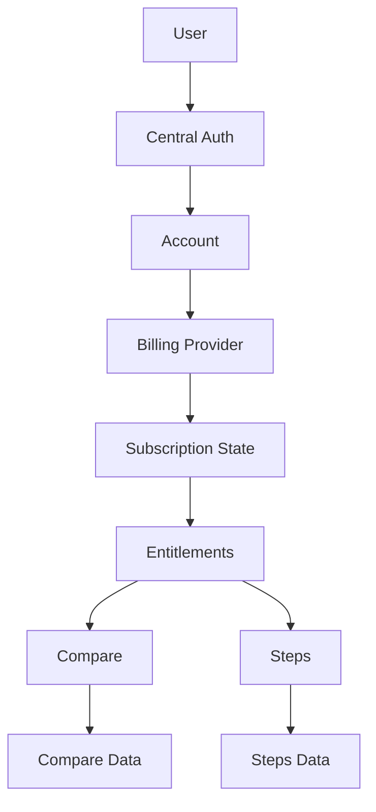

# Product Family Blueprint

This repo is moving from separate MVPs to a family of independent web apps for
solo professionals. Each product should solve one clear job, share the same
account system, and eventually share subscription access.

## Product Inventory

| App | Role | User | Problem | Paid value | Primary channel |
| --- | --- | --- | --- | --- | --- |
| `apps/compare` | Core product | People choosing between products, services, tools, or options | Product specs and trade-offs are scattered and hard to compare objectively | Saved comparisons, curated catalogs, filters, exports, side-by-side decisions | Google search for comparison queries and Reddit buying-advice communities |
| `apps/steps` | Lead magnet, future core candidate | People completing complex paths or life/work processes | Requirements, documents, actions, tools, and order of work are scattered across sources | Saved progress, notes, richer guides, exports, private guides | SEO for task-specific guides and Reddit/community answers |
| `apps/resume` | About page | People evaluating the builder or company behind the tools | Visitors need to know who is behind the product family | Not monetized directly | Main site, backlinks, founder credibility |
| `apps/auth` | Platform | Every product user | A user should sign in once and keep access across tools | Enables shared subscription, profile, and entitlements | Not a growth channel |
| `apps/main` | Product directory | New and returning visitors | Visitors need a clear overview of available tools | Routes users into core and lead-magnet apps | Brand search, direct traffic, internal links |

## MVP Scoring

Scores use `1` to `5`, where `5` is strongest. `Support cost` is reversed:
`5` means easiest to maintain.

| Product | Pain | Frequency | Willingness to pay | SEO potential | Reddit potential | Support cost | Total |
| --- | ---: | ---: | ---: | ---: | ---: | ---: | ---: |
| Compare | 4 | 3 | 4 | 4 | 4 | 3 | 22 |
| Steps | 4 | 4 | 3 | 5 | 4 | 2 | 22 |
| About | 1 | 1 | 1 | 2 | 1 | 5 | 11 |

## Focus Decision

`Compare` is the first paid core product because it can cover many buying and
selection decisions: electronics, GPUs, tools, services, and other curated
categories. The natural paywall is around saved comparisons, premium catalogs,
filters, exports, and decision history.

`Steps` is the first lead magnet because public guide pages can target search
queries and community discussions. It can become paid later through saved
progress, private notes, exports, premium guide packs, or contributor tooling.

`Resume` should be treated as a static "About us" page. `Auth` and `main` are
platform surfaces, not standalone products.

## Subscription Model

Start with one shared subscription before adding per-product plans.

| Plan | Intended user | Access |
| --- | --- | --- |
| Free | Visitor or early user | Public pages, limited saved objects, basic guides |
| Pro | Solo professional | Higher limits, exports, private notes, saved progress, premium guide content |
| Founder | Early supporters | Pro access plus future products while pricing is still being tested |

Entitlements should be checked at feature boundaries, not only at route login.
Examples: exporting compare data, saving more than the free comparison limit,
opening premium catalogs, saving unlimited guide progress, and accessing premium
guide content.

## Go-To-Market

### Compare

- Landing angle: "Compare anything with structured specs, filters, and side-by-side decisions."
- SEO pages: GPU comparison, electronics comparison, product A vs product B, best option for a specific budget/use case, comparison table alternatives.
- Reddit/community: answer buying-advice threads with useful comparison tables and link to a free comparison page only when relevant.
- Activation event: user opens a category and saves or shares the first comparison.
- Paid trigger: exports, saved comparison history, premium categories, advanced filters.

### Steps

- Landing angle: "Step-by-step guides for completing complex paths."
- SEO pages: task-specific guides such as what documents are needed for a process, how to complete a multi-step application, moving abroad checklist, registering a business checklist.
- Reddit/community: publish useful breakdowns in relevant subreddits without leading with the product.
- Activation event: user starts a guide and marks one step done.
- Paid trigger: saved progress across multiple guides, private notes, exports, premium curated guides.

## Analytics Events

Use the same event names across products where possible:

- `landing_viewed`
- `signup_started`
- `signup_completed`
- `activation_completed`
- `paywall_viewed`
- `checkout_started`
- `subscription_started`
- `subscription_canceled`
- `export_completed`
- `retained_week_1`

Each product should define its own activation properties, for example
`product=compare` and `activation=first_answer_saved`.

## Launch Order

1. Keep central SSO stable across `auth`, `compare`, and `steps`.
2. Use `@playground/entitlements` as the shared product/plan contract.
3. Present `compare` and `steps` clearly from `apps/main`.
4. Add analytics around activation and paywall events before paid launch.
5. Ship a lightweight Pro subscription once the first paid boundary is clear.
6. Review product scores every 2 to 4 weeks and either double down, reposition,
   or pause each experiment.
