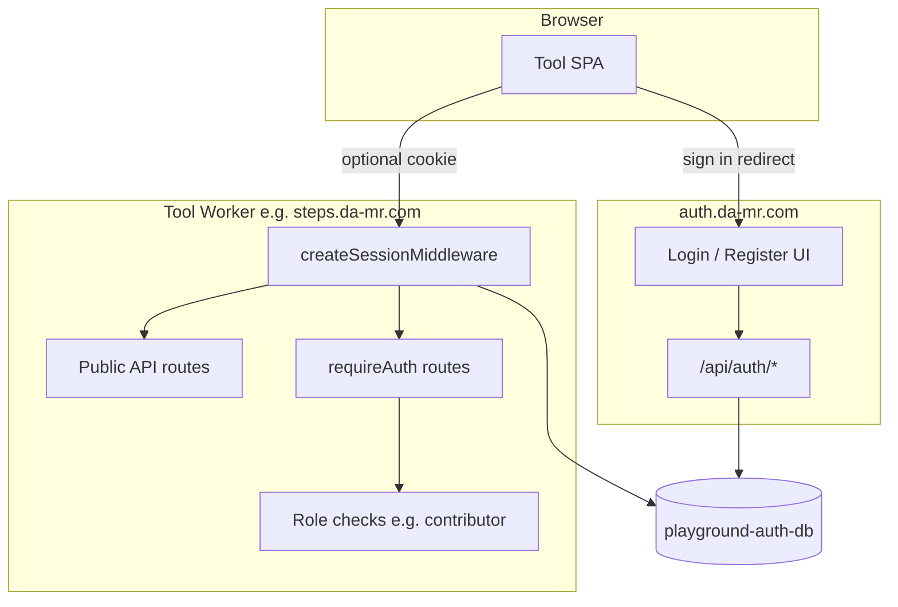

# Authorization model

How authentication and access control work across da-mr.com tools after the
shared auth rollout (`@playground/auth-core`, `@playground/auth-react`, central
login at `auth.da-mr.com`).

For SSO wiring, cookies, and production checklist see [SSO.md](./SSO.md). For
OAuth providers see [OAUTH.md](./OAUTH.md).

---

## Concepts

| Term | Meaning |
| ---- | ------- |
| **Guest** (visitor) | No session cookie. Can use routes and APIs explicitly marked public. |
| **User** | Signed-in account with role `user` (default on register). |
| **Contributor** | Role `contributor` — can edit catalog content where the app allows it. |
| **Admin** | Role `admin` — highest privilege; same gates as contributor unless a route adds admin-only checks. |

Guests are not a separate Better Auth account type. The session middleware runs
on every `/api/*` request; when there is no valid cookie, `userId` is unset and
the request continues as a guest until a route calls `requireAuth`.

---

## Architecture



| Layer | Responsibility |
| ----- | -------------- |
| **Central auth** ([`apps/auth`](../../apps/auth)) | Login/register UI; canonical Better Auth routes; sets `Domain=.da-mr.com` session cookie in production. |
| **Tool Worker** | `createSessionMiddleware` reads the shared cookie via `AUTH_DB`; `mountAuthHandler` exposes same-origin `/api/auth/*` for `useSession` in dev/prod. |
| **Tool SPA** | `createAuthProvider` → `useAuth()`; optional `ProtectedRoute` per page; soft prompts (`SignInPrompt`) where guests can browse but not persist. |

---

## Worker API patterns

### 1. Session middleware (always first on `/api/*`)

```ts
app.use('/api/*', createSessionMiddleware(getAuth))
mountAuthHandler(app, getAuth)
```

Populates Hono context when a cookie is present:

- `userId` — Better Auth user id
- `userRole` — from user record (`user` | `contributor` | `admin`)
- `authUser` — full user object or `null`

When there is **no** session, handlers still run; nothing is thrown.

### 2. Public routes

Skip `requireAuth` for paths guests should call. Mount public routers **before**
the global auth gate, or exempt paths in the gate (Steps uses both).

Examples:

- `/api/health` — liveness
- `/api/auth/*` — Better Auth (sign-in, get-session, sign-out)
- `/api/actions` (Steps) — published catalog read

### 3. Authenticated routes

```ts
export async function requireAuth(c, next) {
  if (!c.get('userId')) return c.json({ error: 'Unauthorized' }, 401)
  await next()
}
```

Use on enrollments, listings, profile mutations, etc.

### 4. Role-gated routes

After `requireAuth`, check `userRole` with `hasMinimumRole(role, 'contributor')`.
Return **403** when the user is signed in but lacks permission (distinct from
401).

Steps contributor API: `apps/steps/worker/src/routes/contributor-actions.ts`.

### 5. Lazy app-user provisioning (Compare)

Compare runs `ensureCompareAppUser` when `userId` is set so the first
authenticated API call mirrors the auth user into the compare D1 schema and
seeds default categories/questions. Guests never hit this path.

---

## Frontend patterns

### Route guards

[`ProtectedRoute`](../../packages/auth-react/src/ProtectedRoute.tsx) redirects
to login when `user` is null. Use **per-route** guards for guest-friendly apps,
not around the entire layout.

**Steps (guest-friendly):**

- Public: `/`, `/actions`, `/actions/:slug`
- `ProtectedRoute`: `/my`, `/contributor/*`

**Compare (account-only today):**

- `ProtectedRoute` wraps the whole app — every page requires sign-in.

Legacy `/login` and `/register` on tools redirect to
`buildAuthLoginUrl(returnUrl)` / `buildAuthRegisterUrl(returnUrl)` (central auth).

### Soft gates (guest browse, login to persist)

On action pages, Steps shows [`SignInPrompt`](../../apps/steps/src/components/action/SignInPrompt.tsx)
when `user` is null. Guests can read the guide; enrollments and progress APIs
stay behind auth.

Pattern: enable TanStack Query fetches that need auth with `enabled: Boolean(user)`.

### API client 401 handling

Tool `apiRequest` helpers redirect to central login on **401** for non-auth
paths (see `apps/steps/src/lib/api.ts`, `apps/compare/src/lib/api.ts`). Public
pages should only call public APIs so guests are not redirected unexpectedly.

---

## Per-app access matrix

### Steps (`apps/steps`)

| Surface | Guest | User | Contributor |
| ------- | ----- | ---- | ----------- |
| Home, catalog, action detail (`/`, `/actions`, `/actions/:slug`) | Yes | Yes | Yes |
| Read published actions API (`GET /api/actions`, `GET /api/actions/:slug`) | Yes | Yes | Yes |
| Start guide, save progress, notes (`/my`, enrollments API) | No — sign in | Yes | Yes |
| Contributor editor (`/contributor/*`, `/api/contributor/actions`) | No | No — 403 | Yes |

Worker gate: `apps/steps/worker/src/index.ts` exempts `/api/health` and
`/api/actions` from `requireAuth`.

Product intent: **SEO-friendly public guides**; login only for saved progress
(see [`apps/steps/OPEN_QUESTIONS.md`](../../apps/steps/OPEN_QUESTIONS.md) Q1).

### Compare (`apps/compare`)

| Surface | Guest | User |
| ------- | ----- | ---- |
| All SPA routes | No — redirect to login | Yes |
| Own listings (create, edit, delete, answers, photos) | No — 401 | Yes |
| Others' **public** listings (list, detail, photos read) | No — 401 (guest browse planned) | Yes — read-only |
| Private listings (others') | No — 404 | No — 404 |
| Questions / categories / export / profile | No — 401 | Yes (own catalog only) |
| `/api/health`, `/api/auth/*` | Yes | Yes |

Worker gate: `apps/compare/worker/src/index.ts` requires auth for every path
except health and auth. Listings carry an `is_public` flag; reads use
`canReadListing()` (owner or public); writes remain owner-only.

Product intent: **signed-in users can browse others' public listings**; guest
access without login is planned (decision **D-09** in
[`docs/DECISIONS.md`](../../docs/DECISIONS.md)).

### Auth app (`apps/auth`)

Login, register, and session management only. No guest product data.

---

## Adding guest support to a new tool

1. **Decide the matrix** — list routes and APIs as public, account-only, or
   role-gated (copy the tables above into the app README or PLAN).
2. **Worker** — mount public routers before `requireAuth`, or maintain an
   `isPublicApiPath()` allowlist.
3. **SPA** — keep `AppLayout` outside `ProtectedRoute`; wrap only account-only
   child routes.
4. **Queries** — guard authenticated fetches with `enabled: Boolean(user)`.
5. **UX** — use inline sign-in prompts instead of hard redirects where guests
   should preview content.
6. **Tests** — extend [`scripts/smoke-auth.sh`](../../scripts/smoke-auth.sh) and
   [`e2e/tests/`](../../e2e/tests/) for new public/protected surfaces.

---

## Roles reference

| Role | Rank | Typical use |
| ---- | ---- | ----------- |
| `user` | 0 | Default; personal data (enrollments, listings). |
| `contributor` | 1 | Edit shared catalog content (Steps actions/steps). |
| `admin` | 2 | Full contributor powers; future moderation. |

Seed users (local): `packages/auth-core/migrations/0002_seed.sql` (`SeedPass123!`).

---

## Verification

From repo root:

```bash
# Unit tests (all workspaces)
pnpm test

# API integration (Workers, curl)
./scripts/smoke-auth.sh

# Browser E2E (Vite + Workers + central login UI)
pnpm test:e2e
```

Smoke script checks:

- Central auth sign-up / sign-in / get-session / sign-out
- Steps: authed enrollments 200, unauthed 401, contributor role 403/200
- Compare: authed listings 200, unauthed 401

E2E (Playwright) covers SPA flows: guest catalog on Steps, login redirect on
Compare, central login return URL. See [`e2e/README.md`](../../e2e/README.md).

---

## Related docs

- [README.md](./README.md) — package API surface
- [SSO.md](./SSO.md) — cross-subdomain cookies and D1
- [OAUTH.md](./OAUTH.md) — Google / Facebook
- [`packages/auth-react/README.md`](../auth-react/README.md) — React provider and guards
- [`AGENTS.md`](../../AGENTS.md) — local dev ports and SSO persist path
