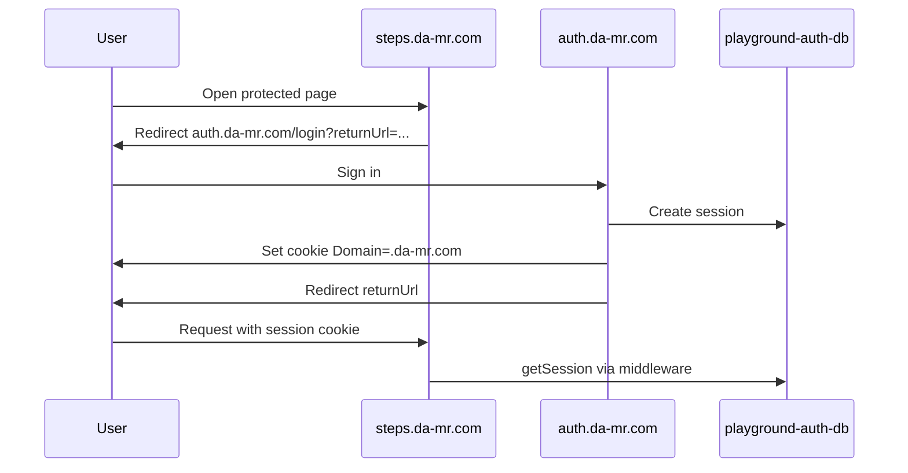

# Cross-subdomain SSO (`*.da-mr.com`)

## Architecture (Option B — central auth)

| Resource | Name | Binding / host |
| -------- | ---- | -------------- |
| Central login UI + `/api/auth/*` | `playground-auth-api` | `auth.da-mr.com` ([`apps/auth`](../../apps/auth)) |
| Shared auth D1 (prod) | `playground-auth-db` | `AUTH_DB` on auth, compare, steps Workers |
| Shared auth D1 (dev) | `playground-auth-db-dev` | `AUTH_DB` on `--env dev` Workers |
| App data | `apartments-db`, `steps-db`, … | `DB` (per tool) |



| Concern | Where |
| ------- | ----- |
| Login / register UI | [`apps/auth`](../../apps/auth) only |
| Better Auth routes (`/api/auth/*`) | Auth Worker only |
| Session validation on tool APIs | `createSessionMiddleware` on each tool Worker |
| Session cookie | `AUTH_COOKIE_DOMAIN=.da-mr.com` (set from auth origin) |
| Browser session (`useSession` on tools) | Same-origin `/api/auth/*` on each tool Worker (or Vite proxy to auth Worker in dev) |
| Login redirect URLs | `VITE_AUTH_ORIGIN` → `getAuthOrigin()` / `buildAuthLoginUrl` |

Migrations for auth tables: [`migrations/`](./migrations/). Apply with:

```bash
pnpm --filter @playground/auth-api db:migrate:auth:remote
```

(One apply per environment — all Workers share the same D1.)

Production database IDs (Cloudflare):

- `playground-auth-db`: `19af03aa-ae46-4c24-9729-fca5941d73bb`
- `playground-auth-db-dev`: `62c9747d-6d66-420f-93ff-d66fcecf29d1`

## Production checklist

1. **Secrets on auth Worker** (canonical for sign-up / OAuth callbacks):

   ```bash
   wrangler secret put BETTER_AUTH_SECRET   # same value on compare + steps
   wrangler secret put BETTER_AUTH_URL      # https://auth.da-mr.com
   ```

   Tool Workers still need the **same** `BETTER_AUTH_SECRET` for session validation.
   `BETTER_AUTH_URL` on tools remains each tool’s public URL (session reads use the
   request origin + shared cookie).

2. **`AUTH_DB` binding** on auth, compare, and steps Workers.

3. **Cookie domain** — `AUTH_COOKIE_DOMAIN = ".da-mr.com"` in auth Worker `[vars]`
   (and tool Workers for consistency).

4. **Trusted origins** — `BETTER_AUTH_TRUSTED_ORIGINS` on the **auth** Worker must
   list every tool SPA origin plus `https://auth.da-mr.com`. Tool Workers list tool
   origins for any legacy direct calls.

5. **Custom domains** — attach `auth.da-mr.com` / `dev-auth.da-mr.com` to
   `playground-auth-api` Worker.

6. **OAuth** — callback URLs only on `https://auth.da-mr.com/api/auth/callback/...`
   (see [`OAUTH.md`](./OAUTH.md)).

7. **Compare app data** — register no longer seeds compare DB. First authenticated
   compare API request runs lazy mirror + seed ([`ensure-app-user.ts`](../../apps/compare/worker/src/ensure-app-user.ts)).

8. **Guest access** — per-app public vs account-only routes are documented in
   [`AUTHORIZATION.md`](./AUTHORIZATION.md). Steps allows guest catalog browse;
   Compare is account-only until public routes ship (D-09).

## Tool SPA configuration

```bash
# Production build (compare / steps)
VITE_AUTH_ORIGIN=https://auth.da-mr.com

# Local Vite dev
VITE_AUTH_ORIGIN=http://localhost:3004
```

Helpers: `buildAuthLoginUrl(returnUrl)`, `buildAuthRegisterUrl(returnUrl)`,
`validateReturnUrl(url)` from `@playground/auth-react`.

`returnUrl` must be an absolute URL on an allowed host (`*.da-mr.com` or local dev
ports). Protected routes and 401 handlers pass `window.location.href`.

## Local dev

| Service | Port |
| ------- | ---- |
| auth Vite | 3004 |
| auth wrangler | 8789 |
| compare Vite | 3002 |
| steps Vite | 3003 |

- `.dev.vars`: leave `AUTH_COOKIE_DOMAIN` empty for host-only cookies. The smoke script
  uses `127.0.0.1` and a shared cookie jar across Worker ports on the same host.
- Auth seeds: `packages/auth-core/migrations/0002_seed.sql` (`SeedPass123!`).
- Smoke: `./scripts/smoke-auth.sh`

## Code

- `getAuthDatabase(env)` — `AUTH_DB ?? DB` ([`src/database.ts`](./src/database.ts))
- `createPlaygroundAuth()` — `crossSubDomainCookies` when `AUTH_COOKIE_DOMAIN` is set
- `mountAuthHandler()` — auth Worker only

## Option A (deprecated)

Per-tool `/login` pages and `mountAuthHandler` on each tool Worker are removed.
Use central auth for all new tools.
